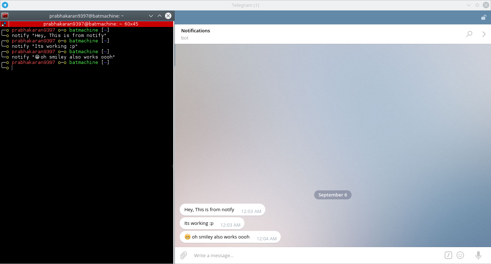

# Notify Me in Telegram

Hello, this will allow you to send messages to your Telegram account from your bot (which you're going to create now)

1) In the global search type `BotFather`

2) Type `/newbot`

3) Provide a suitable name for the bot

4) Choose an username for the bot

5) Note down the <b>token</b> which looks like this
   ```
   Use this token to access the HTTP API:
   123456:ABC-DEF1234ghIkl-zyx57W2v1u123ew11
   ``` 
   
6) Now, we need to find your chat ID

   $ `./TestAndGetMyChatId`
   ```
   Enter Your Bot Token: 123456:ABC-DEF1234ghIkl-zyx57W2v1u123ew11
   Your token is working Properly
   {"ok":true,"result":{"id":123456789,"first_name":"Notifications","username":"botbotbot"}}
   Now, send any message from your Telegram account to your bot
   Send within 10 seconds
   Your Chat ID is 987654321
   A sample message is triggered! Check your Telegram
   ```
   
After getting the working <b>token</b> and working <b>chat ID</b> install it.

## Installing

To download this repository, you may either clone via git:

$ `cd ~`

$ `git clone https://github.com/prabhakaran9397/notify-me-telegram`

or download a source code: [notify-me-telegram](https://github.com/prabhakaran9397/notify-me-telegram/archive/master.zip).

$ `cd ~/notify-me-telegram`

$ `sudo make install`

This is a one time installation

`Enter Your Bot Token: 123456:ABC-DEF1234ghIkl-zyx57W2v1u123ew11`

`Enter Your Chat ID: 987654321`

## Updating

$ `cd ~/notify-me-telegram`

$ `sudo make update`

## Uninstalling

$ `cd ~/notify-me-telegram`

$ `sudo make uninstall`

## Using Notify Me

$ `notify "Hello, What's up?"`

